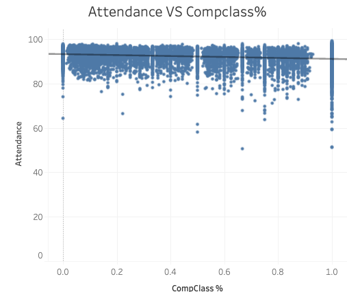
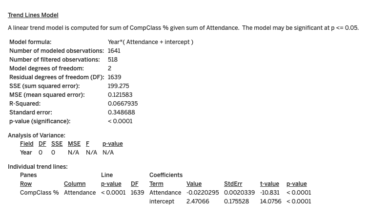
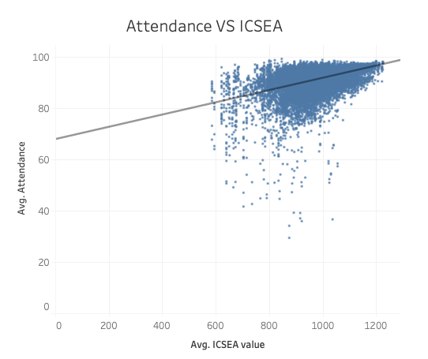
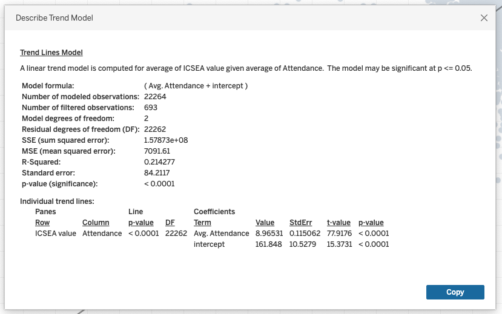
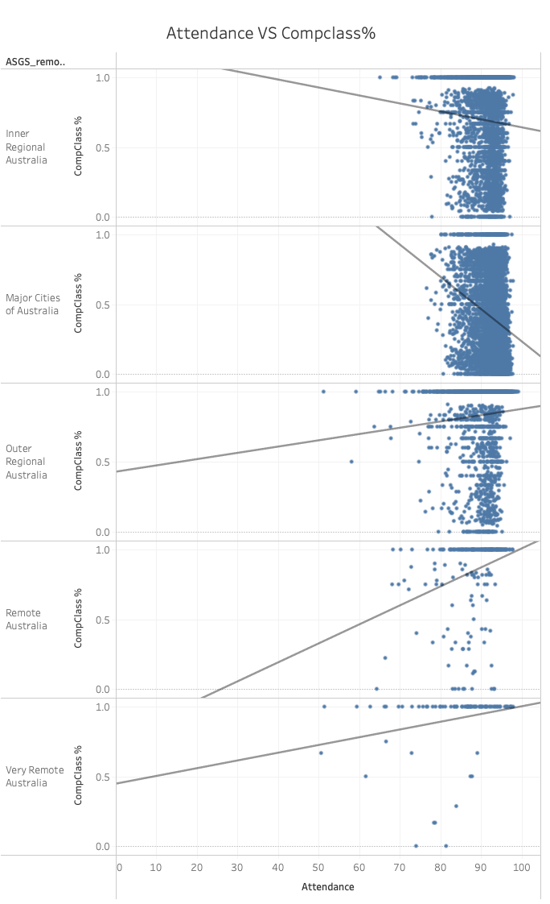

# Correlation Analysis: Attendance, CompClass %, and ASGS Remoteness

## Approach

This analysis focuses on investigating the correlations between Attendance, CompClass % (Composite Class Percentage), and the ASGS (Australian Statistical Geography Standard) remoteness classification. The data from different years has been integrated into a comprehensive dataset to ensure sufficient observations, enhancing the reliability of the correlation analysis. This approach is particularly advantageous when studying the correlation between attendance and CompClass % with respect to the school's remoteness.

Data granularity is maintained at the school and year level. Linear trend models are employed to quantify the correlations between attendance and CompClass % within varying degrees of school remoteness. The analysis is executed using Tableau, and the results are shared via Tableau Online using the following link: [Tableau Results](https://public.tableau.com/views/DOE_CaseStudy_StatisticalModelAnalysis/StatiscalModelAnalysis?:language=en-US&publish=yes&:display_count=n&:origin=viz_share_link).

Due to the similarity in CompClass % and Comp Student %, CompClass % is used in the model to show correlation.

Please note that records with null ASGS_remoteness values (62 records) are excluded from statistical models involving remoteness consideration.

## Hypothesis 1: Correlation between Attendance and CompClass %

### Model Overview

- The linear trend model aims to predict the sum of CompClass % based on the sum of attendance.
- The model formula incorporates the factor "Year," accounting for potential yearly variations.
- Significance is evaluated at p <= 0.05.

### Model Visualization

### Model Statistics

- Number of Modeled Observations: 1641
- Number of Filtered Observations: 518
- Model Degrees of Freedom: 2
- Residual Degrees of Freedom (DF): 1639
- Sum Squared Error (SSE): 199.275
- Mean Squared Error (MSE): 0.121583
- R-Squared: 0.0667935
- Standard Error: 0.348688
- P-Value (Significance): < 0.0001

### Analysis of Variance

- The factor "Year" has 0 degrees of freedom, suggesting potential insignificance.
- Individual trend lines for "Attendance" indicate statistically significant impact on "CompClass %."
- Coefficient for "Attendance": -0.0220295
- Intercept value: 2.47066

## Hypothesis 2: Correlation between Attendance and ICSEA Value

### Model Overview

- Linear trend model investigates the relationship between average ICSEA value and average attendance.
- Model formula includes average attendance and an intercept.
- Significance assessed at p <= 0.05.

### Model Visualization

### Model Statistics

- Number of Modeled Observations: 22264
- Number of Filtered Observations: 693
- Model Degrees of Freedom: 2
- Residual Degrees of Freedom (DF): 22262
- Sum Squared Error (SSE): 1.57873e+08
- Mean Squared Error (MSE): 7091.61
- R-Squared: 0.214277
- Standard Error: 84.2117
- P-Value (Significance): < 0.0001

### Interpretation

- Strong evidence of significant correlation between attendance and ICSEA value.
- Positive coefficient for "Avg. Attendance": 8.96531

## Extra Findings

I hypothesized that varying levels of school remoteness might influence the correlation between attendance and the percentage of computer class attendance (compclass%). Consequently, I conducted distinct correlation analyses, stratified by school remoteness. The results indicate that the impact of compclass% on attendance varies based on the remoteness of the school.

Specifically, within Inner Regional Australia and Major Cities of Australia schools, an inverse coefficient is observed between attendance and compclass%. Conversely, in schools situated in Outer Regional Australia, Remote Australia, and Very Remote Australia, a positive coefficient exists between attendance and compclass%.

It's noteworthy that the R-squared values, indicating the extent to which the model explains the relationship, are relatively modest in Inner Regional Australia and Outer Regional Australia. In comparison, they show a more moderate explanatory capacity in Major Cities of Australia, Remote Australia, and Very Remote Australia.

### Note

- R-Squared values indicate weak to modest relationships explained by the models, depends on the school remoteness.

## Further Exploration for Nuanced Insights

Several unexamined factors could provide additional depth to the analysis:

1. **Student Demographics:** Variables like socio-economic background, ethnicity, and family structure might influence attendance and CompClass %. Exploring these aspects could yield more nuanced findings.

2. **Teaching Methodologies:** Variation in teaching approaches across schools or regions could impact attendance and CompClass %. Accounting for teaching methodologies may provide a richer perspective.

3. **School Policies:** School-specific policies to enhance attendance or classroom dynamics might affect correlations. Factoring in these policies could lead to a more comprehensive understanding.

4. **Parental Involvement:** Parental engagement is significant for both attendance and classroom behavior. Its influence, if considered, could contribute to a more holistic analysis.

5. **Student Motivation:** Students' intrinsic motivations and attitudes toward attendance and participation could shed light on observed trends.

6. **External Factors:** Local events, culture, and economic conditions may play a role in attendance and classroom dynamics. Considering these external influences could provide contextual insights.

7. **Teacher Experience:** Teachers' expertise and training might impact classroom management, affecting attendance and CompClass %.

8. **Health and Well-being:** Students' physical and mental well-being can influence attendance and engagement, warranting consideration.

9. **Parent-Teacher Communication:** Effective communication between parents and teachers might shape attendance and behavior, enhancing the analysis.

10. **School Resources:** Disparities in resources and facilities between schools could underlie attendance and classroom dynamics variations. Accounting for this aspect could offer comprehensive insights.