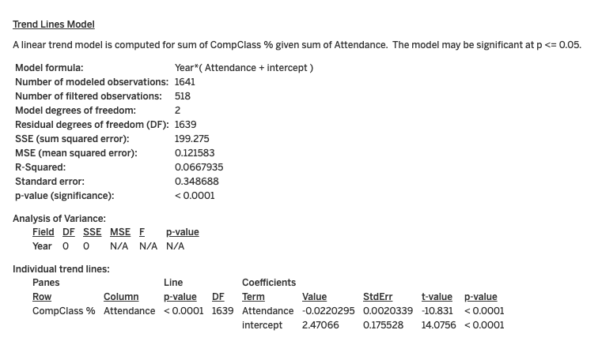

# Correlation Analysis: Attendance, CompClass %, and ASGS Remoteness

## Approach

This analysis focuses on investigating the correlations between Attendance, CompClass % (Composite Class Percentage), and the ASGS (Australian Statistical Geography Standard) remoteness classification. The data from different years has been integrated into a comprehensive dataset to ensure sufficient observations, enhancing the reliability of the correlation analysis. This approach is particularly advantageous when studying the correlation between attendance and CompClass % with respect to the school's remoteness.

Data granularity is maintained at the school and year level. Linear trend models are employed to quantify the correlations between attendance and CompClass % within varying degrees of school remoteness. The analysis is executed using Tableau, and the results are shared via Tableau Online using the following link: [Tableau Results](link_here).

Please note that records with null ASGS_remoteness values (62 records) are excluded from statistical models involving remoteness consideration.

## Hypothesis 1: Correlation between Attendance and CompClass %

### Model Overview

- The linear trend model aims to predict the sum of CompClass % based on the sum of attendance.
- The model formula incorporates the factor "Year," accounting for potential yearly variations.
- Significance is evaluated at p <= 0.05.

### Model Visualization

...

### Model Statistics

- Number of Modeled Observations: 1641
- Number of Filtered Observations: 518
- Model Degrees of Freedom: 2
- Residual Degrees of Freedom (DF): 1639
- Sum Squared Error (SSE): 199.275
- Mean Squared Error (MSE): 0.121583
- R-Squared: 0.0667935
- Standard Error: 0.348688
- P-Value (Significance): < 0.0001

### Analysis of Variance

- The factor "Year" has 0 degrees of freedom, suggesting potential insignificance.
- Individual trend lines for "Attendance" indicate statistically significant impact on "CompClass %."
- Coefficient for "Attendance": -0.0220295
- Intercept value: 2.47066

## Hypothesis 2: Correlation between Attendance and ICSEA Value

### Model Overview

- Linear trend model investigates the relationship between average ICSEA value and average attendance.
- Model formula includes average attendance and an intercept.
- Significance assessed at p <= 0.05.

### Model Statistics

- Number of Modeled Observations: 22264
- Number of Filtered Observations: 693
- Model Degrees of Freedom: 2
- Residual Degrees of Freedom (DF): 22262
- Sum Squared Error (SSE): 1.57873e+08
- Mean Squared Error (MSE): 7091.61
- R-Squared: 0.214277
- Standard Error: 84.2117
- P-Value (Significance): < 0.0001

### Interpretation

- Strong evidence of significant correlation between attendance and ICSEA value.
- Positive coefficient for "Avg. Attendance": 8.96531

## Extra Findings

- Separate correlation models based on school remoteness highlight varying correlations between attendance and CompClass %.
- Negative coefficient in Inner Regional Australia and Major Cities of Australia.
- Positive coefficient in Outer Regional Australia, Remote Australia, and Very Remote Australia.

### Note

- R-Squared values indicate modest relationship explained by the models.
- Further exploration may be needed considering unexamined factors.

