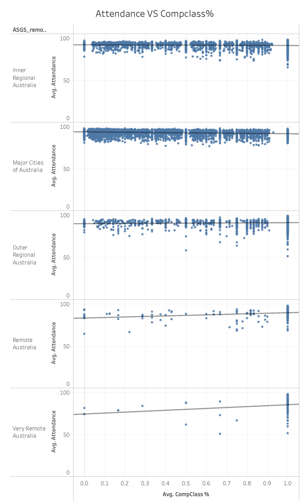
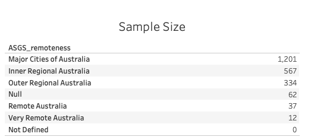

# Correlation Analysis: Attendance, CompClass %, and ASGS Remoteness

## Approach

This analysis focuses on investigating the correlations between Attendance, CompClass % (Composite Class Percentage), and the ASGS (Australian Statistical Geography Standard) remoteness classification. The data from different years has been integrated into a comprehensive dataset to ensure sufficient observations, enhancing the reliability of the correlation analysis. This approach is particularly advantageous when studying the correlation between attendance and CompClass % with respect to the school's remoteness.

Data granularity is maintained at the school and year level. Linear trend models are employed to quantify the correlations between attendance and CompClass % within varying degrees of school remoteness. The analysis is executed using Tableau, and the results are shared via Tableau Online using the following link: [Tableau Results](https://public.tableau.com/views/DOE_CaseStudy_StatisticalModelAnalysis/StatiscalModelAnalysis?:language=en-US&publish=yes&:display_count=n&:origin=viz_share_link).

Due to the similarity in CompClass % and Comp Student %, CompClass % is used in the model to show correlation.

Please note that records with null ASGS_remoteness values (62 records) are excluded from statistical models involving remoteness consideration.

## Hypothesis 1: Correlation between Attendance and CompClass %

## Trend Lines Model

A linear trend model has been established to examine the relationship between the average of Attendance and the average of CompClass %. The model's significance is assessed at a p-value threshold of <= 0.05.

### Hypothesis:

**Hypothesis:** There is a significant correlation between attendance and the percentage of "CompClass %" (CompClass percentage) among the observed data.

### Model Overview:

- **Model formula:** (Avg. CompClass % + intercept)
- **Modeled observations:** 13186
- **Filtered observations:** 9771
- **Model degrees of freedom:** 2
- **Residual degrees of freedom (DF):** 13184
- **SSE (sum squared error):** 185687
- **MSE (mean squared error):** 14.0843
- **R-Squared:** 0.0395164
- **Standard error:** 3.7529
- **p-value (significance):** < 0.0001

### Individual Trend Lines:

- The analysis focuses on the trend line depicting the correlation between Attendance and Avg. CompClass %.
- For "Avg. CompClass %," the p-value is < 0.0001, implying a statistically significant impact on Attendance.
- The coefficient for "Avg. CompClass %" is -2.1457, suggesting that for each unit increase in the average of CompClass %, Attendance decreases by this amount.
- The intercept value is 93.1779, signifying the expected Attendance when the average of CompClass % is zero.

### Model Visualization:

### Interpretation:

- The R-Squared value of 0.0395164 denotes that approximately 3.95% of the variability in Attendance can be elucidated by the variation in the average of CompClass %.
- The p-value of < 0.0001 provides robust evidence of a significant correlation between the average of CompClass % and Attendance.
- The negative coefficient for "Avg. CompClass %" implies that as the average of CompClass % increases, Attendance tends to decrease.

### Conclusion:

Based on this analysis, compelling statistical evidence supports a noteworthy correlation between the average of CompClass % and Attendance. Nevertheless, the relatively modest R-Squared value suggests that the model's ability to explain Attendance variance based on the average of CompClass % is limited. Delving into additional factors influencing this relationship might be prudent.

## Hypothesis 2: Correlation between Attendance and ICSEA %

A linear trend model has been established to examine the relationship between the average of Attendance and the average of ICSEA value. The model's significance is assessed at a p-value threshold of <= 0.05.

### Hypothesis:

**Hypothesis:** There is a significant correlation between attendance and the ICSEA (the Index of Community Socio-Educational Advantage) among the observed data.

### Model Overview:

- **Model formula:** (Avg. ICSEA value + intercept)
- **Modeled observations:** 22264
- **Filtered observations:** 693
- **Model degrees of freedom:** 2
- **Residual degrees of freedom (DF):** 22262
- **SSE (sum squared error):** 420876
- **MSE (mean squared error):** 18.9056
- **R-Squared:** 0.214277
- **Standard error:** 4.34805
- **p-value (significance):** < 0.0001

### Individual Trend Lines:

- The analysis focuses on the trend line depicting the correlation between Attendance and Avg. ICSEA value.
- For "Avg. ICSEA value," the p-value is < 0.0001, indicating a statistically significant impact on Attendance.
- The coefficient for "Avg. ICSEA value" is 0.0239007, suggesting that for each unit increase in the average of ICSEA value, Attendance increases by this amount.
- The intercept value is 67.9207, signifying the expected Attendance when the average of ICSEA value is zero.

### Model Visualization:

### Interpretation:

- The R-Squared value of 0.214277 indicates that around 21.43% of the variability in Attendance can be explained by the variation in the average of ICSEA value.
- The p-value of < 0.0001 provides strong evidence of a significant correlation between the average of ICSEA value and Attendance.
- The positive coefficient for "Avg. ICSEA value" implies that as the average of ICSEA value increases, Attendance tends to increase.

### Conclusion:

Based on this analysis, compelling statistical evidence supports a significant correlation between the average of ICSEA value and Attendance. The relatively high R-Squared value suggests that the model can explain a notable portion of Attendance variance based on the average of ICSEA value. Nevertheless, additional factors influencing this relationship might warrant further investigation.

## Extra Findings

I hypothesized that varying levels of school remoteness might influence the correlation between attendance and the percentage of computer class attendance (compclass%). Consequently, I conducted distinct correlation analyses, stratified by school remoteness. The results indicate that the impact of compclass% on attendance varies based on the remoteness of the school.

Specifically, within Inner Regional Australia and Major Cities of Australia schools, an inverse coefficient is observed between attendance and compclass%. Conversely, in schools situated in Outer Regional Australia, Remote Australia, and Very Remote Australia, a positive coefficient exists between attendance and compclass%.

It's noteworthy that the R-squared values, indicating the extent to which the model explains the relationship, are relatively modest in Inner Regional Australia and Outer Regional Australia. In comparison, they show a more moderate explanatory capacity in Major Cities of Australia, Remote Australia, and Very Remote Australia.

### Sample Size:

The size of samples used for this analysis can be seen from the graph below:

### Note

- R-Squared values indicate weak to modest relationships explained by the models, depends on the school remoteness.

## Further Exploration for Nuanced Insights

### Teacher Experience & Quality:

Teachers' expertise and training can significantly impact classroom management, potentially affecting both attendance and CompClass %. Research suggests that teacher quality is a critical factor in determining student success (Hattie, 2003).

### Student Demographics:

Various demographic variables such as socio-economic background, ethnicity, and family structure can exert an influence on attendance and CompClass %. Notably, in the context of Australian schools, the role of Aboriginal and Torres Strait Islander Students, particularly in remote areas, could be pivotal in understanding the composite class effect on attendance rate.

### School Resources:

The school environment and available resources play a crucial role in student attendance (Kearney, 2021). Disparities in resources and facilities among schools might contribute to variations in attendance and classroom dynamics.

### References:

- Hattie, J. (2003). Teachers make a difference: What is the research evidence? *2003 Research Conference of the Australian Council for Educational Research – Building teacher quality: What does the research tell us?* Melbourne: Australian Council for Educational Research.

- Kearney, C. A. (2021). Integrating systemic and analytic approaches to school attendance problems: synergistic frameworks for research and policy directions. *Child and Youth Care Forum*, 50(6), 701-742. doi:10.1007/s10566-020-09591-0.