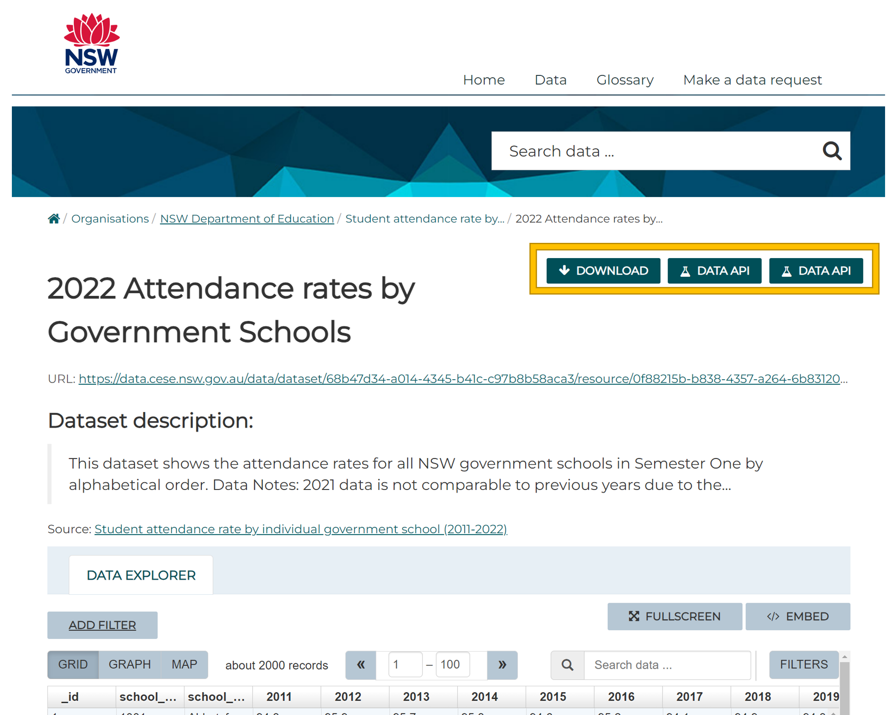
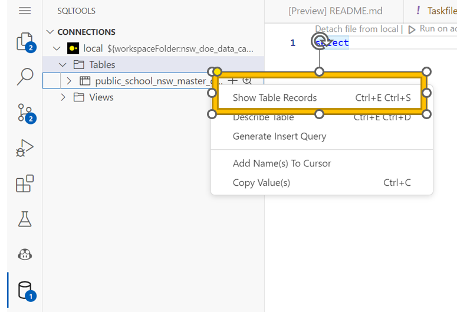

# New South Wales Department of Education (NSW DOE) - Data Case Study 🦘

[](https://codespaces.new/wisemuffin/nsw_doe_data_case_study?quickstart=1)
<!-- [](https://gitpod.io/#https://github.com/wisemuffin/nsw_doe_data_case_study) -->


[New South Wales Department of Education (NSW DOE)](https://education.nsw.gov.au/) are looking for humans who are passionate about improving education.

We created this case study for our aspiring data team members to show off some data skills and use some of the data we work with.

**We want this case study to be as seamless as possible and take as little of your time as possible.** That’s why we are using github code spaces which instantly sets up the same environment for you.

Find out more about the [NSW Department of Education](https://education.nsw.gov.au/)


# The Case Study

## Background

You will get data sets from the [NSW Department of Education](https://education.nsw.gov.au/). We want you to ingest the data into a database, model the data and then analyse the data to provide us with some insights.

The data sets include (more info below):
- Attendance
- Multi-age composite classes (classes are made up of students drawn from different year levels)
- School properties

## Your Task

Multi-age classes may benefit students both socially and emotionally. NSW consistently performs above the national average in NAPLAN testing.

You have been tasked to bring some data into the data warehouse (duckdb) and provide some analysis into:

**Does multi age composite classes have an impact on attendance rates?**

## What are we testing?

	- Your ability to solve problems
	- SQL modelling. Its only 3 datasets don’t go crazy. We are not fussed on what data modelling technique you choose (dimensional, one big table, ect)
	- Data analysis. Give us your opinions and insights on what you find in the data
	- Document your work (nothing fancy, a simple README.md file is more than enough)
    - Work with version control (git)

## Step 1 - Setup the case study environment


### 1.a Click the big green 'Use this template' button and 'Create a new repository'.

**First make sure you have logged into github. You may need to sign up. If you havent logged in the template button wont appear.**


This will create a new repository exactly like this one, and navigate you there. Make sure to execute the next instructions in that repo.

### 1.b Click 'Code', then 'Codespaces, then 'Create codespace on main'.


This will create a new `codespace`, a sandboxed devcontainer with everything you need for the project.

### 1.c Make sure to wait til the codespace is finished setting up.

**This will take around 2 mins to provision the environment**


After the container is built and connected to, VSCode will run a few clean up commands and then a `postCreateCommand`, a set of commands run after the container is set up. This is where we install our dependencies, such as pandas, the duckdb adapter, and other necessities. That screen will look something like the above. When it's completed it will close and leave you in a fresh terminal prompt (like below). From there you're ready to do some data analysis!


## Step 2 - Investigating data already loaded into the database

[public_school_nsw_master_dataset](https://data.cese.nsw.gov.au/data/dataset/nsw-public-schools-master-dataset) has already been loaded into the database which contains NSW public school fields. To run some SQL lets first get into the `duckdb cli` by entering the following into the command line:

<!-- -- ```bash
-- task duck
-- ```
-- Then lets run some sql via the `duck cli` to quickly review how to issue sql commands via duckdb:

-- ```sql
-- select * from public_school_nsw_master_dataset;
-- ```
-- DuckDB primarily uses the SQL standard. For some examples see [duckdb sql](https://duckdb.org/docs/sql/introduction).
-- **when using the CLI** you need to include a semi colon `;` at the end of each statement.

-- To exit the `duckdb cli` simply type `ctrl + d`. -->

Have a look at the data by running the following sql with sqltools duckdb driver:


## Step 3 - Ingest data

### 3.a Explore the data

Ontop of the [public_school_nsw_master_dataset](https://data.cese.nsw.gov.au/data/dataset/nsw-public-schools-master-dataset) preloaded into our warehouse lets bring in two more data sets. First preview the data for some initial data profiling, nice! Simply click on each link to preview the data:

[2022 Attendance rates by Government Schools](https://data.cese.nsw.gov.au/data/dataset/student-attendance-rate-by-school/resource/0f88215b-b838-4357-a264-6b83120065ba)

[2022 Multi age_composite classes)](https://data.cese.nsw.gov.au/data/dataset/multi-age-or-composite-classes-in-nsw-government-schools/resource/30dd6e15-2333-427c-9952-9b7a2190ded0) (hint this data needs some pivoting (columns for each year))

### 3.b Download the data

Feel free to choose to either download the data locally or connect to the APIs to get the data:



> **Not familiar with working on Linux?**
>
> No worries, we mostly use windows too. You can simply run the `wget` command like so to download the data localy:
>
> `wget <url> -O ./data/<name of file>`
>
> example: 
> ```bash
> wget https://data.cese.nsw.gov.au/data/dataset/027493b2-33ad-3f5b-8ed9-37cdca2b8650/resource/2ac19870-44f6-443d-a0c3-4c867f04c305/download/master_dataset.csv -O ./data/public_school_nsw_master_dataset.csv
> ```
>


### 3.c Ingest the data
Several options:

- [Duckdb csv import method](https://duckdb.org/docs/guides/import/csv_import)
- [Duck db via pandas dataframe](https://duckdb.org/docs/guides/python/import_pandas)
- Loads of other options see [duckdb guides](https://duckdb.org/docs/guides/index)

## Step 4 - Model the data

Perform any cleaning and modelling you think is necessary. We are not fussed on what data modelling technique you use (dimensional, one big table, ect).

Simply create your sql transformations as views or tables or just simple queries in the `./modelling/` folder.

### Hints

- the grain of the analysis is at the school level
- one of the data sets will need to be [unpivoted](https://duckdb.org/docs/sql/statements/unpivot.html#:~:text=Unpivot%20Statement%20%2D%20DuckDB&text=The%20UNPIVOT%20statement%20allows%20multiple,value%20from%20the%20source%20column).)

<!-- ### Step 4a - Connect to duckdb via duckdb cli

Simply run `task duck` to get into the duckdb cli and then run your sql via:

```duckdb cli
.read modelling/example_model.sql
```

check out the new model:

```duckdb cli
select * from example_model;
``` 
-->

### Step 4a - Run you sql in duckdb via sqltools

Here is an example of creating a table with sql tools:


Then you can query tables like we did above:


Now your turn. Model the data as you see fit before using it for the analysis step coming up next.


<!-- ### SQL editor by IDE (optional)

If you rather use a SQL IDE rather than duckdb's CLI we have also provided you with [Harlequin](https://duckdb.org/docs/guides/sql_editors/harlequin.html) 

To open the harlequin sql editor simply run:
```bash
task sql
```


Check out the docs at [Harlequin](https://duckdb.org/docs/guides/sql_editors/harlequin.html) for more details.

**If you get an error here saying `Error: unable to open database please close the CLI version first!** -->

## Step 5 - Analyse the data

Now the fun part! We want you to analyse the data and provide us with some insights. Feel free to use any tool you like. Couple of options that are aleady setup for you:

- [Jupyer notebooks](https://jupyter.org/) (Python). We have already setup a jupyter notebook for you to use. See folder `./analysis/analysis-jupyter` for more details. Do all your analysis and insights within the notebook. Select the python 3.11 kernel when prompted. Any additional libraries you add to the environment please add them to ./requirements.txt so we can also use them when viewing your work.
- [Evidence](https://evidence.dev) (Low code option in markdown and SQL) - an open source, code-based BI tool to write reports with markdown and SQL. See folder `./analysis/analysis-evidence` for some examples. Simply do all your analysis and insight call outs in Evidence. For more detail on Evidence please see section on Tools included below.

Feel free to also bring the data from the data modellingg step into any tool you like. Some more examples:
- Duckdb APIs exist for most languages (R, C++, Rust) and ODBC. See [duckdb apis](https://duckdb.org/docs/api/overview) so feel free to connect to your favourite tool. We are just assessing your ability to communicate your insights.
- Export data after modelling in duckdb into a csv and bring into excel and do your insights in powerpoint
- Export data after modelling in duckdb into a csv and bring into powerbi. 
- **hardest option** Port forward duckdb from the codebase to your local machine and connect to it via your favourite tool.

# Submitting your work

There are two possible senarios for submitting your work:

## Submitting your work - If all your work is contained in this codespace

Make sure all you work is committed and pushed to your coppied repo.

Make sure the repo is public and send us the link to your repo.

## Submitting your work - If you did your analysis outside of the codespace

Simply drag any external files into the **./analysis/** folder and commit them to your repo. If you have any issues then feel free to attach the files and send to us.

Make sure all you work is committed and pushed to your coppied repo.

Make sure the repo is public and send us the link to your repo.

# Tools included

<!-- - [Harlequin](https://duckdb.org/docs/guides/sql_editors/harlequin.html) SQL IDE in a CLI for duck db. Simply run `task sql` to open the sql editor. -->
<!-- - [SQLTools Duckdb](https://github.com/RandomFractals/duckdb-sql-tools) - SQLTools is a light weight and cross platform database client tool. It supports MySQL, PostgreSQL, Microsoft SQL Server, Microsoft Azure, Oracle, Amazon Redshift, SQLite, Snowflake, Sybase, SAP Hana, and more. We can use the duckdb driver to connect to our duckdb database as an alternative to the CLI. -->
- BI reporting built with [Evidence](https://evidence.dev) - an open source, code-based BI tool to write reports with markdown and SQL.

<!-- ### Harlequin
SQL IDE for duckdb
[Harlequin](https://duckdb.org/docs/guides/sql_editors/harlequin.html) SQL IDE in a CLI for duck db. Simply run `task sql` to open the sql editor.

 -->

<!-- ### SQLTools Duckdb

You can run your .sql simply by clicking the run button:


#### Connect to the database

Using the **duckdb CLI** is quick to setup, but we want to do some data modelling based on .sql files stored in **./modelling/**

Use the [Duckd DB SQL tools extentions](https://marketplace.visualstudio.com/items?itemName=RandomFractalsInc.duckdb-sql-tools) simply click the extension icon (connection is already setup, you are welcome!):


And then you can proceed to once again preview the data by clicking:



#### Limitation

sqltools duckdb only provides write (create, update, delete) to pro licences see section on [SQLTools DuckDB Read Only](https://github.com/RandomFractals/duckdb-sql-tools). This project just uses the free Read-only version. 

So only advisable if you want to pay for the pro version. 

Also can only use up till 0.7.1 (which doesnt cover duckdbs unpivot)
-->

### Evidence

With Evidence you can:

- Version control your BI layer
- Deploy your reports to a static site

#### Running Evidence

To run Evidence, use:

```shell
task evidence
```

A popup will appear in your browser with a preview of your report. Or simply click ports and select port 3000:


See the [Evidence CLI docs](https://docs.evidence.dev/cli) for more details.

You can make changes to the markdown pages in the `analysis/analysis-evidence/pages` folder and see the reports update in the browser preview.

#### Learning More about Evidence

- [Getting Started Walkthrough](https://docs.evidence.dev/getting-started/install-evidence)
- [Project Home Page](https://www.evidence.dev)
- [Github](https://github.com/evidence-dev/evidence)
- [Evidence.dev Releases](https://github.com/evidence-dev/evidence/releases)


# FAQ

## Code space is running slow or disconnecting
If you have an unstable connection or you want to reduce latency between you and the IDE (integrated development environment) you can run VScode locally and it will remotley connect to the code space. This helps solve lots of latency issues.


## Duckdb error unable to open database


If you get an error here saying `Error: unable to open database "./database/nsw_doe_data_case_study.duckdb": IO Error: Could not set lock on file "./database/nsw_doe_data_case_study.duckdb": Resource temporarily unavailable` then please close any other duckdb connections:
- if you are connected via the cli please close the connection (ctrl + d) 
- please disconnect from SQL tools duckdb connection.


Duckdb when running in memory doesnt support similatnious connections. This limitation is currently being worked on.
[Click to see more info about this limitation ](https://github.com/evidence-dev/sqltools-duckdb-driver/issues/4)


# Contributing

We welcome issues and PRs requesting or adding new features.
